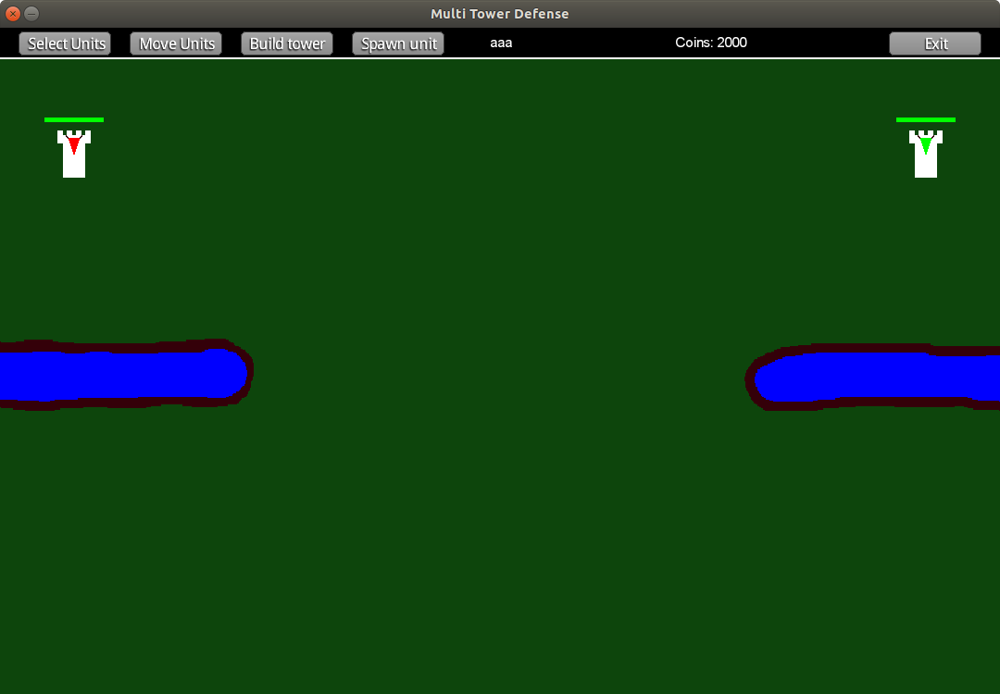
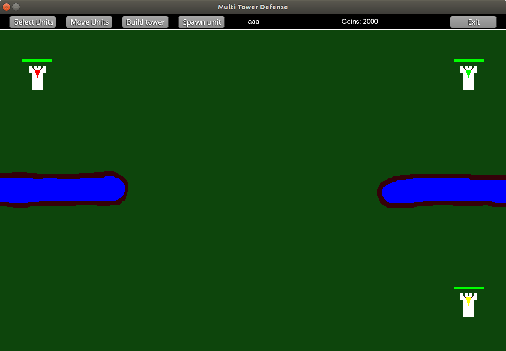
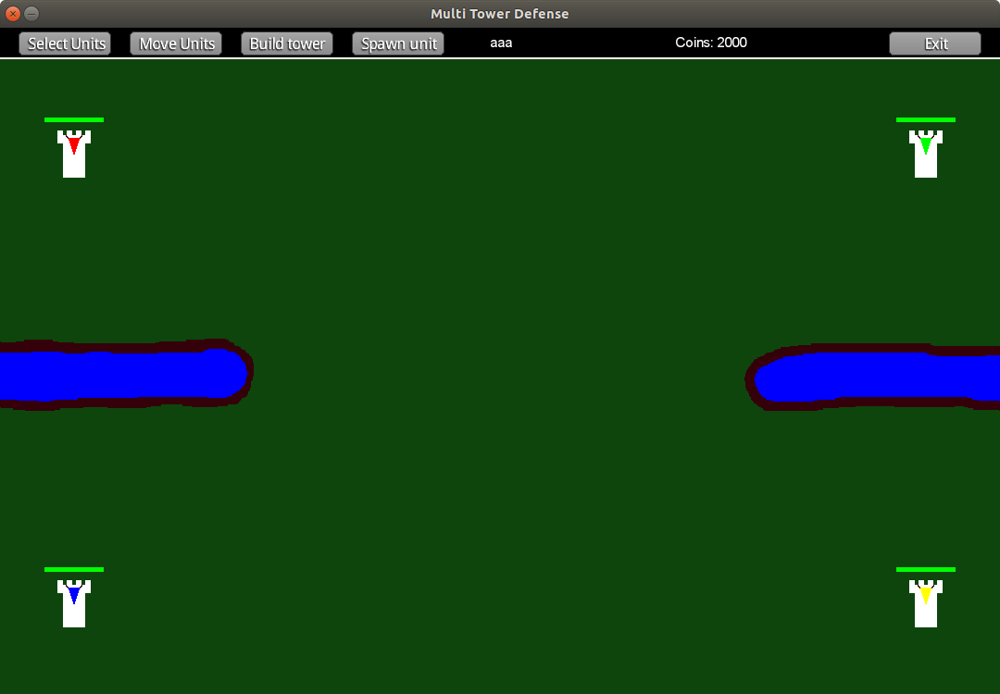
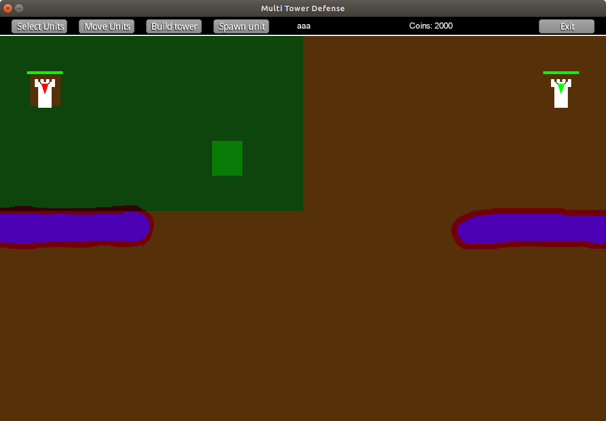
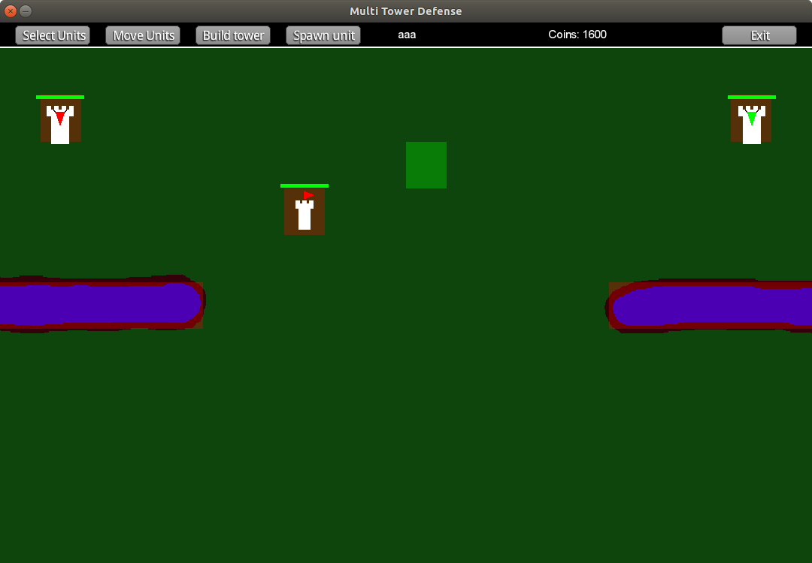
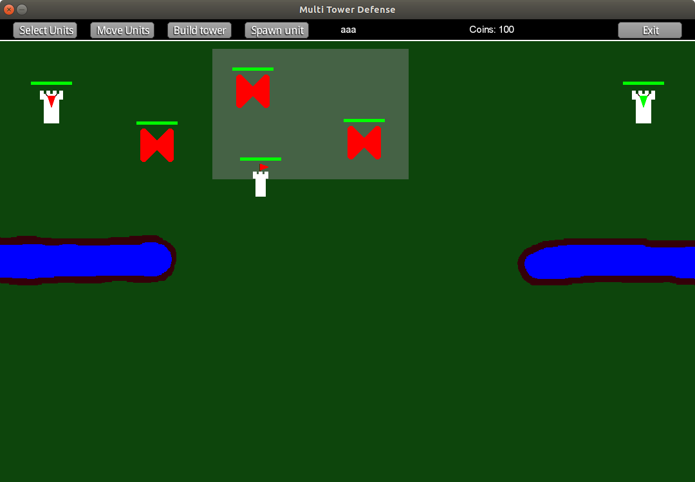
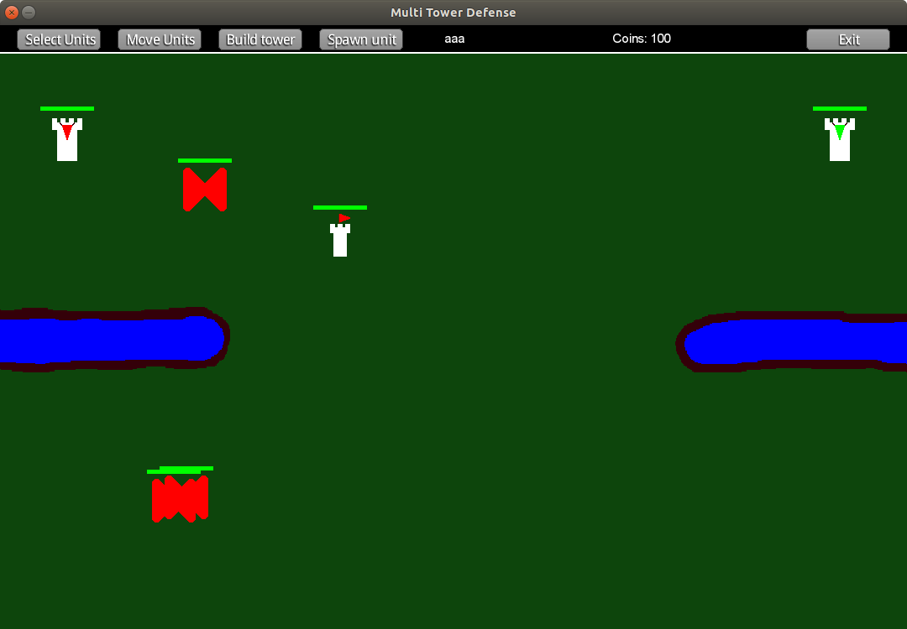

# Multi Tower Defense

## A Tower Defense Game with a Twist

## Start a game

In order to start a game one of the players needs to create a game. After
that they will need to wait in the game room for other players, that can
join their room. Once everybody is present the game creator has to start
the game.

## How To Play

Every player has one goal - to destroy their enemy's main tower. Every player has exactly one enemy - it's the player occupying the next corner of the map, counting clockwise. Each player occupies their own corner.
Main towers are bigger and stronger than normal towers - each player starts with exactly one main tower.

#### 2-player variant

Both players are enemies for each other:

#### 3-player variant

Player -> Enemy: 
Red -> Green 
Green -> Yellow 
Yellow -> Red

#### 4-player variant

Player -> Enemy: 
Red -> Green 
Green -> Yellow 
Yellow -> Blue 
Blue -> Red

## Interaction Modes

You can interact with the map in different modes - select, move, build or spawn. You can choose the interaction mode by clicking a button at the top of the screen.

### Building Towers

Once you click `Build tower` you enter the build mode. In the game the map is divided into cells - to build a tower you need to choose the cell, that it will occupy. Towers are always centered in their cells. 
As you can see in the screenshot, once you enter Build mode some of the cells are highlighted - red highlight means that you can't build in this cell, and green highlight is the currently chosen cell (you choose a cell by hovering your cursor above it). 
Each player has a territory limited to their quarter of the map, in which they can build. 
Building a tower costs 400 coins.

### Spawning Units

Once you click `Spawn unit` you enter the spawn mode. Just as with building, some of the cells are highlighted red - this means that you cannot spawn in these cells. Unlike towers, several units can be present in the same cell at the same time and they are not centered in the cell they occupy. 
As you can see, you cannot spawn units in cells with buildings or natural obstacles. 
Spawning a unit costs 500 coins.

### Unit movement

Once you spawn a unit, you can order it to go somewhere. All of your units know and remember if they are supposed to move at your command, or if they are not. You can change it by clicking `Select Units` and entering Select mode.  
In Select mode you select an area of the map, as it can be seen in the screenshot. You do this by clicking on the map and dragging the cursor. Once you release the cursor all of the units that were inside the gray selection rectangle will now respond to Move commands, and all of the units outside the selection will no longer respond to Move commands.

Now, by clicking `Move Units` you can enter Move mode. If you click anywhere on the map in this mode, you give a Move command. All of the selected units will now respond to this command - they will move to the target on the shortest possible path. If the target is not achievable they will try to get as close as they can (in terms of distance to the target)  
In the screenshot only the selected units responded to the command and moved to the lower part of the map.

### Coins and rewards

You start every game with 2000 coins - you can spend them on new towers and units. You can also earn coins for killing your opponents' units and towers - it does not matter if they are your enemy or are neutral to you.

## Config file

The stats of all the units, towers, maps, etc. are described in the config file `core/assets/config/config.txt`. You can change some of the parameters there if you want - just remember to update the server, as it contains and simulates the only valid state of the game.

## Dev help section

#### Installing libgdx

Follow the info [here](https://libgdx.badlogicgames.com/documentation/)

#### Unit tests

We are using junit4 - [tutorial for using junit with libgdx in android studio](http://techduke.io/junit-testing-of-libgdx-game-in-android-studio/)
